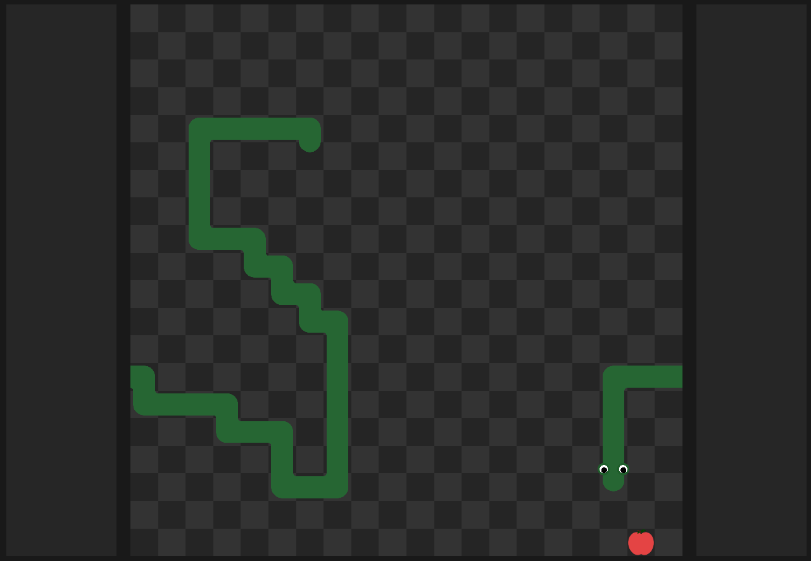

# Snake (OpenGL)
### - [How to build project?](#how-to-build-project)  
### - [Hotkeys](#hotkeys)  
### - [Config](#config)


<!-- <br> -->
<br>

## How to build project
To build this project you should have [CMake](https://cmake.org/download/) on your computer.
Clone repo and use these commands in console in the local repo:
```shell
cmake -B build -S .
cmake --build build
``` 
`cmake -B build -S .` to generate build files,  
`cmake --build build` to build project.

Also you can generate build files and build project with CMake GUI.

Repo contains `CMakePresets.json` and, if you have generators and compilers listed in these presets, you can use these commands instead of ones listed above:
```shell
cmake --preset <preset_name>
cmake --build --preset <preset_name>
```

You can have some issues with building project because of idk how to write correct CMakeLists.txt.

## Hotkeys
`wasd` or `key_up key_down key_left key_right` - move snake  
`p` - freeze/unfreeze game  
`ctrl + =` - scale up  
`ctrl + -` - scale down  
`ctrl + z` - zen mode  

## Config
You can change field size, snake color, and more in config file. Program creates directory and config file if you start the program for the first time in the path:  
- `AppData/Snake_OpenGL/config` for Windows;
- `home/.local/share/Snake_OpenGL/config` for Linux.
