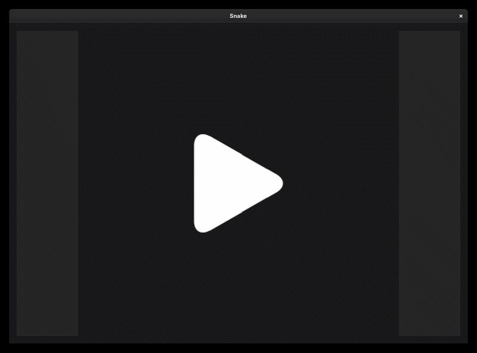
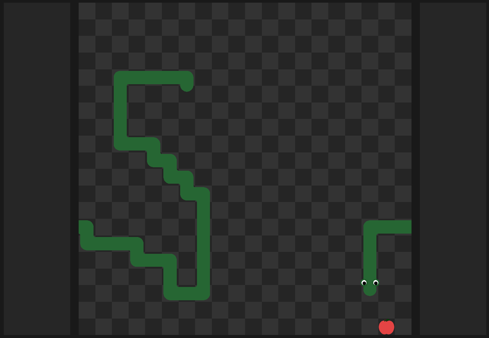

# Snake (OpenGL)
### - [How to build project?](#how-to-build-project)  
### - [Hotkeys](#hotkeys)  
### - [Config](#config)


<!-- <br> -->
<br>
<!--<br>-->

## How to build project
You should have [CMake](https://cmake.org/download/) on your computer to build this project.
Clone repo and use these commands in console in the local repo:
```shell
cmake -B build -S .
cmake --build build
``` 
`cmake -B build -S .` to generate build files,  
`cmake --build build` to build project.

Repo contains `CMakePresets.json` and, if you have generators and compilers listed in these presets, you can use these commands instead of ones listed above:
```shell
cmake --preset <preset_name>
cmake --build --preset <preset_name>
```

You may have some issues with building project because idk how to write correct CMakeLists.txt.

## Hotkeys
`wasd` or `key_up key_down key_left key_right` - move snake
`escape` in menu - exit game,  
         in game - exit to menu
`space` in menu or lbm on play icon - play game
`p` - freeze/unfreeze game  
`ctrl + =` - scale up  
`ctrl + -` - scale down  
`ctrl + z` - zen mode  

## Config
You can change field size, snake color, and more in config file. Program creates directory and config file if you start the program for the first time in the path:  
- `AppData/Snake_OpenGL/config` for Windows;
- `home/.local/share/Snake_OpenGL/config` for Linux.
